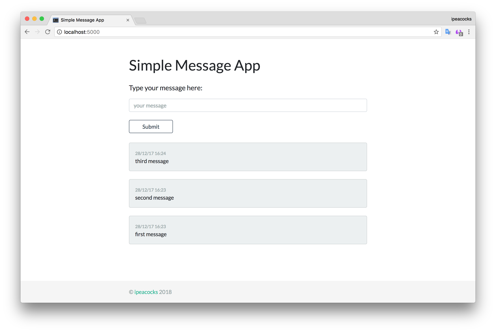

# Simple Message App

Simple Python/Flask app for demonstrating Docker/Kubernetes facilities
<p align="center">
  
</p>
Written on:

* Bootstrap 4
* Python 3
* Flask Framework
* SQLAlchemy
* WTForms
* SQLite

### Installation

Clone code:
```
# git clone git@github.com:ipeacocks/docker-flask.git
```
Simply create virtualenv:
```
# cd docker-flask
# virtualenv --python=/usr/local/bin/python3 --no-site-packages env
```
Activate virtual env:
```
# source env/bin/activate
```
That's almost it. Use `requirments.txt` to setup all python dependencies:
```
# pip install -r requirements.txt
```
Create sqlite db:
```
# python db_create.py
```
And finally launch:
```
# python run.py
```
Then you can login using link http://localhost:5000.

## Docker

Alternatively you can run this app in docker. Pull image from Docker Hub:
```
# docker pull ipeacocks/docker-flask
```
And simply run it:
```
# docker run -d -p 5000:5000 ipeacocks/docker-flask
```
That's all.
